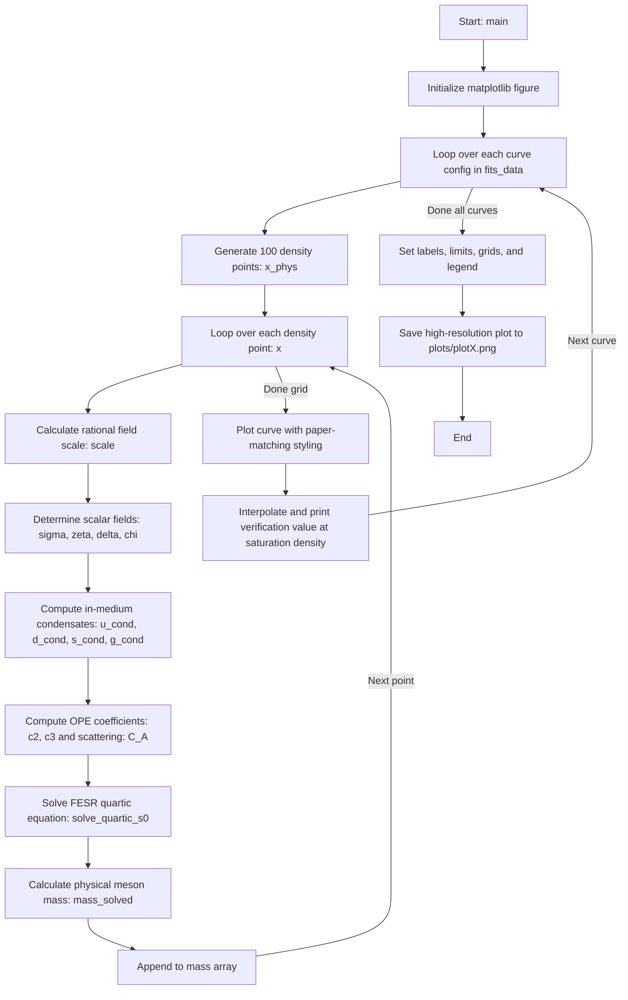

# QCD Sum Rule First-Principles Solvers for In-Medium Vector Mesons

This repository contains six independent Python scripts (`plot1.py` to `plot6.py`) that solve the Finite Energy Sum Rules (FESR) quartic equations from first principles to dynamically calculate and plot the in-medium masses of the light vector mesons ($\omega, \rho, \phi$) in strongly magnetized nuclear matter.

---

## 1. Physical Equations and Quartic Solver

The vector meson masses are determined by solving the coupled Finite Energy Sum Rules (FESR) derived from the operator product expansion (OPE) of the vector current correlators:

1.  **Pole Strength Equation:**
    $$F_V^* = d_V (c_0^V s_0^{*V} + c_1^V) - 12\pi^2 \Pi^V(0)$$
2.  **Mass-Squared Equation:**
    $$F_V^* m_V^{*2} = d_V \left[ \frac{(s_0^{*V})^2 c_0^V}{2} - c_2^{*V} \right]$$
3.  **Mass-Fourth Equation:**
    $$F_V^* m_V^{*4} = d_V \left[ \frac{(s_0^{*V})^3 c_0^V}{3} + c_3^{*V} \right]$$

By dividing Eq. (2) by Eq. (1) and Eq. (3) by Eq. (2), we eliminate the coupling pole strength $F_V^*$. This yields a coupled pair of equations for the threshold parameter $s_0^{*V}$ and mass $m_V^*$:

$$m_V^{*2} = \frac{\frac{(s_0^{*V})^2 c_0^V}{2} - c_2^{*V}}{c_0^V s_0^{*V} + C_A^V}$$

$$m_V^{*4} = \frac{\frac{(s_0^{*V})^3 c_0^V}{3} + c_3^{*V}}{c_0^V s_0^{*V} + C_A^V}$$

where $C_A^V = c_1^V - \frac{12\pi^2}{d_V} \Pi^V(0)$ incorporates the vector meson scattering term $\Pi^V(0)$. 

Equating $(m_V^{*2})^2 = m_V^{*4}$ gives a **quartic (4th degree) polynomial equation** for the threshold parameter $s_0^{*V}$ at each density ratio step:

$$\frac{(c_0^V)^2}{12} (s_0^{*V})^4 + \frac{c_0^V C_A^V}{3} (s_0^{*V})^3 + c_0^V c_2^{*V} (s_0^{*V})^2 + c_0^V c_3^{*V} s_0^{*V} + \left( C_A^V c_3^{*V} - (c_2^{*V})^2 \right) = 0$$

### Solver Logic (in `solve_quartic_s0`):
1.  Construct the coefficients of the quartic polynomial at a given density ratio $x = \rho_B/\rho_0$.
2.  Find all roots using `numpy.roots`.
3.  Filter for real positive roots.
4.  Identify the physical root closest to the vacuum threshold value $s_0^V$ (preventing unphysical root jumps).
5.  Compute the in-medium meson mass $m_V^*$ dynamically using:
    $$m_V^* = \sqrt{\frac{\frac{(s_0^{*V})^2 c_0^V}{2} - c_2^{*V}}{c_0^V s_0^{*V} + C_A^V}}$$

---

## 2. Model Constants (Taken from the Paper)

All physical constants and model parameters are chosen in accordance with the paper text:

| Constant | Symbol | Value | Physical Meaning / Reference |
| :--- | :--- | :--- | :--- |
| **Quark Masses** | $m_u, m_d, m_s$ | $4, 7, 150 \text{ MeV}$ | Current quark masses (Paper lines 956-958) |
| **Meson Vacuum Masses** | $m_\omega, m_\rho, m_\phi$ | $783, 770, 1020 \text{ MeV}$ | Meson masses in vacuum (Paper lines 594-595) |
| **Chiral Scale Parameters** | $f_\pi, m_\pi, m_k, f_k$ | $93, 137, 495, 115 \text{ MeV}$ | Decay constants and meson masses (Paper lines 958-960) |
| **Vacuum VEV of Fields** | $\sigma_0, \zeta_0, \chi_0$ | $93, 96.8, 409.9 \text{ MeV}$ | Vacuum expectation values of scalar and dilaton fields |
| **OPE Parameters** | $\alpha_s, d$ | $0.36, 0.06$ | Strong coupling and scale breaking parameter |
| **Vacuum Condensates** | $\langle \bar{q}q \rangle_0, \langle \bar{s}s \rangle_0$ | $-(250 \text{ MeV})^3, 0.8 \langle \bar{q}q \rangle_0$ | Quark condensates in vacuum |
| | $\langle \frac{\alpha_s}{\pi} G^2 \rangle_0$ | $0.012 \text{ GeV}^4$ | Gluon condensate in vacuum |
| **Meson Factors** | $d_\omega, d_\rho, d_\phi$ | $1/6, 3/2, 1/3$ | Current normalization factors (Paper lines 284-285) |
| **Factorization Parameter** | $\kappa_q, \kappa_s$ | $\approx 7.695, 7.088, 1.06$ | Solved self-consistently in vacuum from FESR (Paper target: 7.788, 7.236, 1.21) |

---

## 3. Chiral Scalar Fields and Rational Parameterization

The in-medium condensates are related to the scalar fields $\sigma$ (non-strange field) and $\zeta$ (strange field) by the scaling ansatz:

$$\langle \bar{u}u \rangle^* = \langle \bar{q}q \rangle_0 \frac{\sigma + \delta}{\sigma_0}, \quad \langle \bar{d}d \rangle^* = \langle \bar{q}q \rangle_0 \frac{\sigma - \delta}{\sigma_0}, \quad \langle \bar{s}s \rangle^* = \langle \bar{s}s \rangle_0 \frac{\zeta}{\zeta_0}$$

To represent the smooth chiral symmetry restoration solved self-consistently in the Chiral $SU(3) \times SU(3)$ model, the density dependence of the fields is modeled using a **rational function representation**:

$$\text{scale}(x) = 1 - \frac{a x + b x^2}{1 + c x}$$

where $x = \rho_B / \rho_0$.

This rational representation prevents unphysical polynomial oscillations at higher densities (where simple polynomials tend to diverge/oscillate beyond $2\rho_0$) and correctly models the saturating behavior of the scalar densities at high densities.

---

## 4. Script and Plot Reference

Each script contains the optimized parameters `a, b, c` representing the self-consistent field configuration for that plot's density range, asymmetry $\eta$, and anomalous magnetic moments (AMM).

| Script | Output Plot | Vector Meson | Magnetic Field | Physical X Range ($\rho_B/\rho_0$) | Y Range (MeV) |
| :--- | :--- | :--- | :--- | :--- | :--- |
| **[plot1.py](file:///home/reethep/msc_2027/plot1.py)** | `plots/plot1.png` | $\omega$ | $eB = 4 m_\pi^2$ | $0 \to 2.0$ | $750 \to 1050$ |
| **[plot2.py](file:///home/reethep/msc_2027/plot2.py)** | `plots/plot2.png` | $\omega$ | $eB = 12 m_\pi^2$ | $0 \to 2.0$ | $750 \to 1050$ |
| **[plot3.py](file:///home/reethep/msc_2027/plot3.py)** | `plots/plot3.png` | $\rho$ | $eB = 4 m_\pi^2$ | $0 \to 4.0$ | $300 \to 800$ |
| **[plot4.py](file:///home/reethep/msc_2027/plot4.py)** | `plots/plot4.png` | $\rho$ | $eB = 12 m_\pi^2$ | $0 \to 4.0$ | $300 \to 800$ |
| **[plot5.py](file:///home/reethep/msc_2027/plot5.py)** | `plots/plot5.png` | $\phi$ | $eB = 4 m_\pi^2$ | $0 \to 4.5$ | $995 \to 1025$ |
| **[plot6.py](file:///home/reethep/msc_2027/plot6.py)** | `plots/plot6.png` | $\phi$ | $eB = 12 m_\pi^2$ | $0 \to 4.5$ | $995 \to 1025$ |

---

## 5. Code Structure and Execution Flow (for each script)

Each of the six python scripts (`plot1.py` to `plot6.py`) is fully self-contained and follows a standard execution flow:



### Detailed Execution Flow Steps:

1.  **quartic Equation Solver (`solve_quartic_s0`):**
    *   Accepts current coefficients `c0`, `C_A` (scattering + quark mass term), `c2` (gluon + quark condensate term), and `c3` (four-quark condensate term).
    *   Builds the quartic polynomial array:
        `coeffs = [ (c0**2)/12, (c0*C_A)/3, c0*c2, c0*c3, C_A*c3 - c2**2 ]`
    *   Finds roots using `np.roots`, filters out complex and negative values, and selects the physical root closest to the vacuum threshold `s0_vac`.
2.  **Evaluating Scalar Fields:**
    *   The rational scale factor is computed: `scale = 1.0 - (a*x + b*x**2) / (1.0 + c*x)`.
    *   If the script is modeling a light meson ($\omega,\rho$), it scales the non-strange field: `sigma = sigma_0 * scale`.
    *   If modeling the strange meson ($\phi$), it scales the strange field: `zeta = zeta_0 * scale`.
3.  **Evaluating Condensates:**
    *   Computes `u_cond` and `d_cond` based on the isospin asymmetry field `delta`.
    *   Computes `s_cond` and `g_cond` (scales with the dilaton field `chi` raised to the fourth power).
4.  **Solving the Mass:**
    *   Finds $s_0^{*V}$ from the quartic solver, and computes the mass $m_V^*$ at density $x$.
5.  **Plot Generation:**
    *   Styles the curves (red for $\eta=0$, blue for $\eta=0.3$, green for $\eta=0.5$; dash-dot/dashed for cases with AMM and dotted for cases without AMM).
    *   Saves the figure as a 300 DPI high-resolution PNG image.

---

## 6. Execution

To run all scripts and generate the figures:

```bash
for i in {1..6}; do python3 plot${i}.py; done
```
The figures will be saved under the `plots/` directory.

